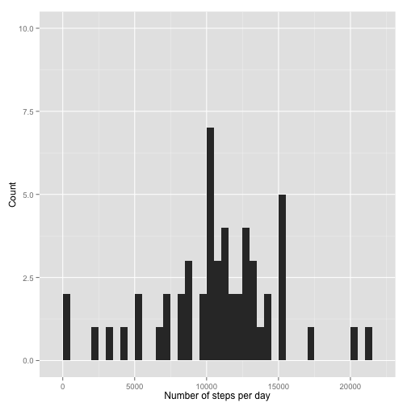
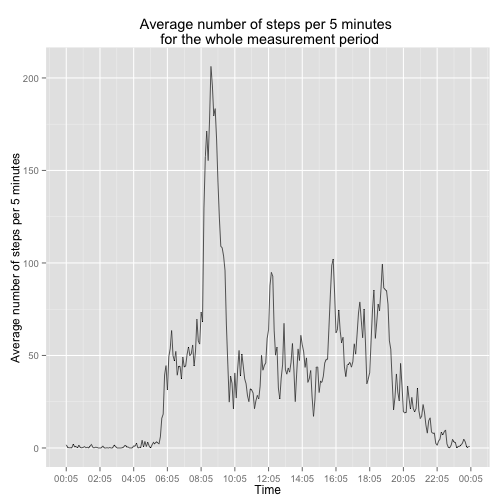
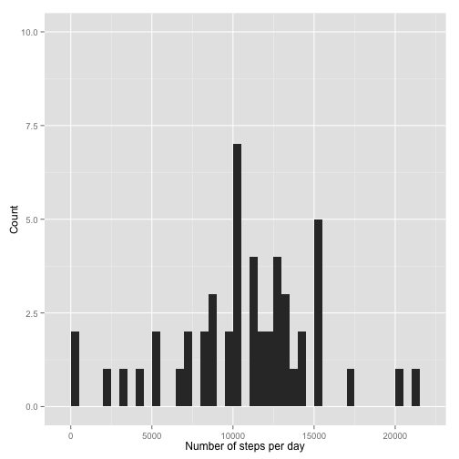
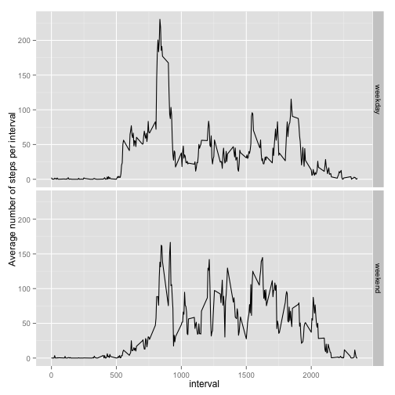

### Loading and preprocessing the data
Change working directory and load the data.

```r
library(ggplot2)
library(xtable)
library(data.table)
library(scales) #To be able to format time in ggplots
setwd("~/Documents/Diverse/Coursera Reproducible Research /Peer Assesment 1/Peeras1/RepData_PeerAssessment1/")
df <- read.csv("activity.csv") #Read and convert to data.table
df$date.new <- strptime(paste(as.character(df$date),sprintf("%04.f",df$interval)),format = "%Y-%m-%d %H%M") #Create a new date column in format POSIX
df$time <- strptime(sprintf("%04.f",df$interval),format = "%H%M") #Create a new date column in format POSIX
```

### What is mean total number of steps taken per day?
Below is the code to produce a histogram on number of steps per day.

```r
df.perday <- aggregate(steps~date,df,sum)
qplot(steps,data=df.perday,geom="histogram",ylim=c(0,10),xlab="Number of steps per day",ylab="Count",binwidth=500)
```

 

```r
summary(df.perday)
```

```
##          date        steps      
##  2012-10-02: 1   Min.   :   41  
##  2012-10-03: 1   1st Qu.: 8841  
##  2012-10-04: 1   Median :10765  
##  2012-10-05: 1   Mean   :10766  
##  2012-10-06: 1   3rd Qu.:13294  
##  2012-10-07: 1   Max.   :21194  
##  (Other)   :47
```

Here is the code for producing the mean and average total number of steps per day.

```r
steps.median <- median(df.perday$steps)
steps.mean <- mean(df.perday$steps)
p <- xtable(data.frame("Median number of steps per day"=steps.median,"Mean number of steps per day"=steps.mean))
print(p,typ="html")
```

<!-- html table generated in R 3.1.2 by xtable 1.7-4 package -->
<!-- Sun May 17 22:59:01 2015 -->
<table border=1>
<tr> <th>  </th> <th> Median.number.of.steps.per.day </th> <th> Mean.number.of.steps.per.day </th>  </tr>
  <tr> <td align="right"> 1 </td> <td align="right"> 10765 </td> <td align="right"> 10766.19 </td> </tr>
   </table>

### What is the average daily activity pattern?

```r
steps.mean.per.day <- aggregate(steps~interval,df,mean) #calculate mean steps per 5-minute interval.
steps.mean.per.day$hour <- strptime(sprintf("%04.f",steps.mean.per.day$interval),format = "%H%M") #Create a new date column in format POSIX
steps.mean.per.day$hour <- as.POSIXct(steps.mean.per.day$hour)#format as POSIXct
steps.max.count <- steps.mean.per.day[which.max(steps.mean.per.day$steps),]$steps #find max number of steps during an average day.
steps.max.count <- sprintf("%.1f",steps.max.count) #formatting
steps.max.hour <- steps.mean.per.day[which.max(steps.mean.per.day$steps),]$hour #find the hour for the max number
steps.max.hour <- format(steps.max.hour,"%H:%M") #formatting
p <- ggplot(steps.mean.per.day,aes(hour,steps)) + geom_line(size=.3)
p <- p + scale_x_datetime(breaks = date_breaks("2 hour"),labels = date_format("%H:%m"))
p <- p + labs(list(title="Average number of steps per 5 minutes \n for the whole measurement period",y="Average number of steps per 5 minutes",x="Time"))
p
```

 

The 5-minute interval that contains highes average of steps is **08:35**. This interval have on average **206.2** steps.

### Imputing missing values

```r
missing.count <- sum(is.na(df$steps)) #Calculating the total number of missing values in column steps
```
The total number of missing values in the data is **2304**.
Below is the code for imputing data into the NAs.  
The strategy for imputing is to use the average 5-minute interval value and impute this into NA for the with the same 5-minute interval.  


```r
df.imputed <- df #create a copy of df 
na.ind <- which(is.na(df.imputed$steps),arr.ind = T) #find the indices where steps are NA.
temp <-merge(df.imputed[na.ind,],steps.mean.per.day,by="interval",all.x=T)#lookup the 5-minute interval value and place in an intermediate "temp" table.
df.imputed <- merge(df.imputed,temp,by=c("interval","date"),all.x=T) #Combined table with both all existing values and a column with replace values.
na.ind <- which(is.na(df.imputed$steps),arr.ind = T) #new indices of NA rows since the table changed structure.
df.imputed[na.ind,]$steps <- df.imputed[na.ind,]$steps.y #Assign the lookuped value into the NAs.
df.imputed <- df.imputed[-c(5:10)] #drop unecessary columns

df.imputed.perday <- aggregate(steps~date,df.imputed,sum) #aggregate the steps per day
qplot(steps,data=df.imputed.perday,geom="histogram",ylim=c(0,10),xlab="Number of steps per day",ylab="Count",binwidth=500)
```

 

```r
steps.median <- median(df.imputed.perday$steps)
steps.mean <- mean(df.imputed.perday$steps)

p <- xtable(data.frame("Median number of steps per day"=steps.median,"Mean number of steps per day"=steps.mean))
print(p,typ="html")
```

<!-- html table generated in R 3.1.2 by xtable 1.7-4 package -->
<!-- Sun May 17 22:59:02 2015 -->
<table border=1>
<tr> <th>  </th> <th> Median.number.of.steps.per.day </th> <th> Mean.number.of.steps.per.day </th>  </tr>
  <tr> <td align="right"> 1 </td> <td align="right"> 10766.19 </td> <td align="right"> 10766.19 </td> </tr>
   </table>
Imputing data had the follwing impact:  

* The mean steps per day is the same as without imputing.

* The median steps per day increased a little when imputed.

The reason is that the imputed values are  based on the mean and median of the total values and therefore these should not change too much.

### Are there differences in activity patterns between weekdays and weekends?
Below are code to prepare the graph that compares weekends and weekdays.

```r
df.imputed$daytype <- weekdays(df.imputed$date.new.x) %in% c("Söndag","Lördag")create a new column "daytype" which contains TRUE for weekends.
df.imputed$daytype <- as.factor(ifelse(df.imputed$daytype,"weekend","weekday")) #Create a factor with labels Weekend and weekdays.
df.imputed.split <- split(df.imputed,df.imputed$daytype) #Create a list with two elements, one for weekdays and one for weekends.
df.imputed.split <- lapply(df.imputed.split,function(x) aggregate(x$steps~x$interval,x,mean))#group per interval per list element
lns <- sapply(df.imputed.split,nrow) #caluclate number of rows in each list element
df.imputed.split <- do.call(rbind,df.imputed.split) #rbind the list with the average values
newcol <- c(rep("weekday",lns[1]),rep("weekend",lns[2])) #prepare a new column with only character "weekdays" and "weekends"
df.imputed.split <- cbind(df.imputed.split,datetype=newcol) #cbind the new column to the imputed values.
setnames(df.imputed.split,c("interval","steps","datetype")) #change the column names (using package data.table)
qplot(interval,steps,data=df.imputed.split,facets=datetype~.,geom="line",ylab="Average number of steps per interval")
```

 
   
Yes, there are difference between weekdays and weekends:

* During the weekends, the number of steps start later in the morning, indicating that the person do not start moving as early.

* The large peak around 08:30 (seen from the previous picture), does not exist in the same extent during weekends. Maybe the person walk to work during weekdays.

* On average, the person seems to move more during the day during weekends. The average seams higer.
