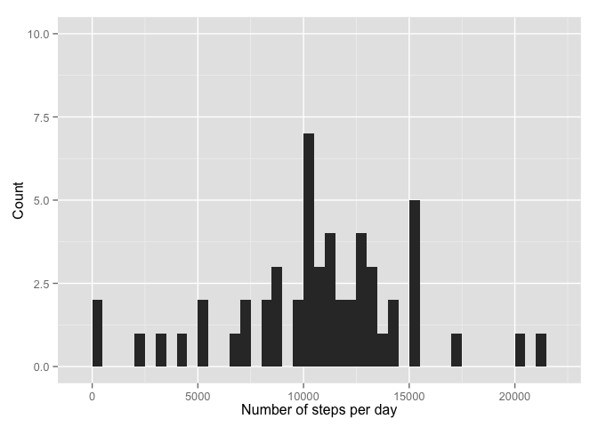

# Reproducible Research: Peer Assessment 1


### Loading and preprocessing the data
Change working directory and load the data.

```r
library(ggplot2)
library(xtable)
setwd("~/Documents/Diverse/Coursera Reproducible Research /Peer Assesment 1/Peeras1/RepData_PeerAssessment1/")
df <- read.csv("activity.csv") #Read and convert to data.table
df$date.new <- strptime(paste(as.character(df$date),sprintf("%04.f",df$interval)),format = "%Y-%m-%d %H%M") #Create a new date column in format POSIX
```

### What is mean total number of steps taken per day?
Below is the code to produce a histogram on number of steps per day.

```r
df.perday <- aggregate(steps~date,df,sum)
qplot(steps,data=df.perday,geom="histogram",ylim=c(0,10),xlab="Number of steps per day",ylab="Count",binwidth=500)
```

 

```r
summary(df.perday)
```

```
##          date        steps      
##  2012-10-02: 1   Min.   :   41  
##  2012-10-03: 1   1st Qu.: 8841  
##  2012-10-04: 1   Median :10765  
##  2012-10-05: 1   Mean   :10766  
##  2012-10-06: 1   3rd Qu.:13294  
##  2012-10-07: 1   Max.   :21194  
##  (Other)   :47
```

Here the the code for producing the mean and average total number of steps per day.

```r
steps.median <- median(df.perday$steps)
steps.mean <- mean(df.perday$steps)
p <- xtable(data.frame("Median number"=steps.median,Mean=steps.mean))
print(p,typ="html")
```

<!-- html table generated in R 3.1.2 by xtable 1.7-4 package -->
<!-- Sat May 16 23:20:20 2015 -->
<table border=1>
<tr> <th>  </th> <th> Median.number </th> <th> Mean </th>  </tr>
  <tr> <td align="right"> 1 </td> <td align="right"> 10765 </td> <td align="right"> 10766.19 </td> </tr>
   </table>


## What is the average daily activity pattern?


## Imputing missing values


## Are there differences in activity patterns between weekdays and weekends?
